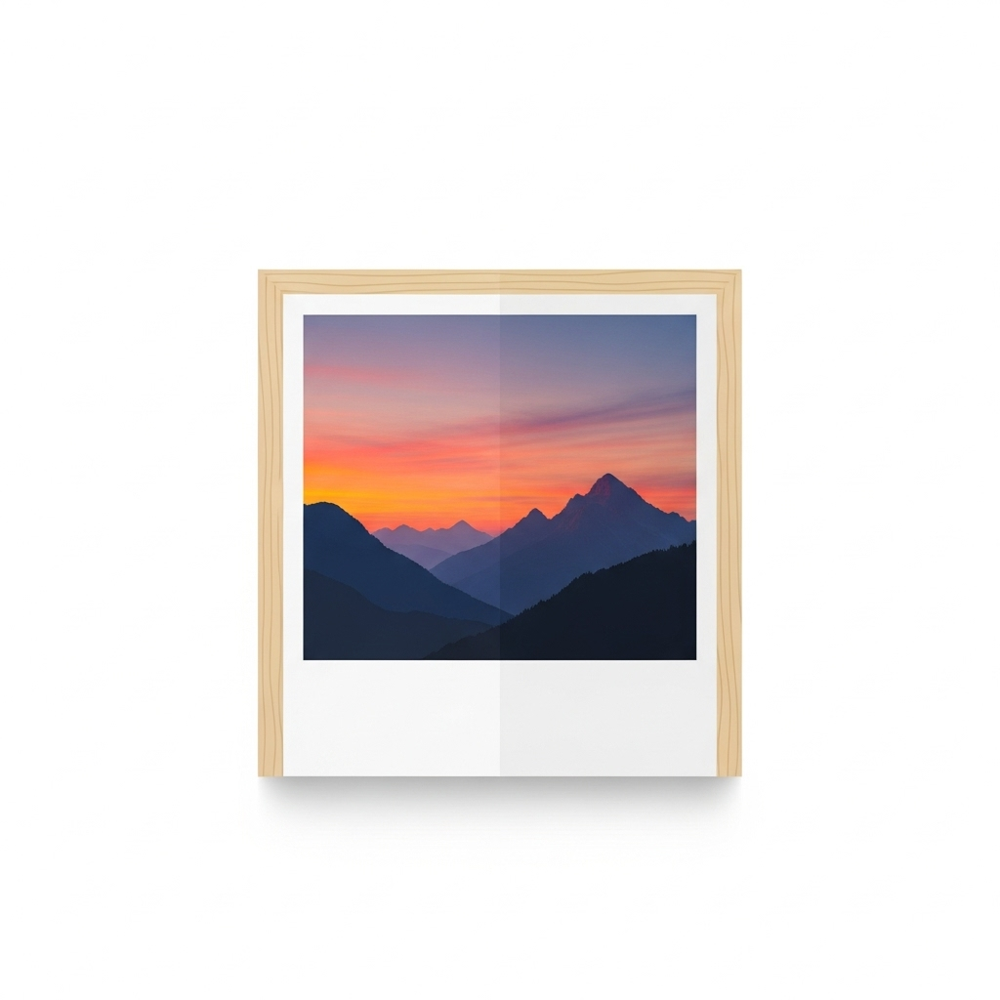

# PhotoFrame - Cornice Digitale per Home Assistant



Trasforma il tuo tablet in una elegante cornice digitale con slideshow automatico, completamente integrata con Home Assistant.

## 🎯 Caratteristiche

- **Slideshow a schermo intero** con transizioni fluide
- 🎴 **Custom Lovelace Card Integrata** - Visualizza lo slideshow direttamente nella dashboard
- 🎬 **13 Effetti di Transizione** - Dissolvenza, slide, zoom, Ken Burns, 3D flip, spirale e altro
- **Upload foto** tramite drag & drop o selezione file
- **Gestione galleria** con griglia thumbnails e eliminazione
- **Controlli slideshow** (play/pause, avanti/indietro)
- **Impostazioni personalizzabili** (intervallo tra foto 5-60 secondi)
- **Editor Visuale** - Configura la card senza YAML
- **Auto-fullscreen** - La card diventa screensaver dopo inattività
- **Auto-hide controlli** dopo 3 secondi di inattività
- **100% Privato** - tutte le foto rimangono sul tuo server Home Assistant
- **API REST** per controllo remoto

## 📦 Installazione

### Metodo 1: Tramite Repository (Consigliato)

1. In Home Assistant, vai su **Impostazioni** → **Add-on** → **Add-on Store**
2. Clicca sui **tre puntini** in alto a destra → **Repository**
3. Aggiungi questo URL: `https://github.com/EdisonACDC/photoframe-addon`
4. Cerca "PhotoFrame" negli add-on
5. Clicca **Installa**
6. Abilita **Avvia all'avvio** e **Watchdog**
7. Clicca **Avvia**

### Metodo 2: Installazione Manuale

1. Copia la cartella `photoframe` su una chiavetta USB
2. Collegala al tuo server Home Assistant
3. Vai su **Impostazioni** → **Add-on** → **Add-on Store**
4. Clicca sui **tre puntini** → **Controlla aggiornamenti**
5. L'add-on apparirà nella lista "Locale"
6. Installa e avvia

## 🚀 Utilizzo

### Sul Tablet (App Standalone)

1. Apri il browser del tablet
2. Vai su: `http://homeassistant.local:5000`
   (oppure l'IP del tuo Home Assistant: `http://192.168.1.XXX:5000`)
3. Carica le tue foto tramite drag & drop
4. Clicca "Avvia Slideshow"
5. Metti il browser a schermo intero

### 🎴 Nella Dashboard Home Assistant (Lovelace Card)

L'add-on include automaticamente una **custom Lovelace card** per visualizzare lo slideshow direttamente nella tua dashboard!

#### Installazione Card:

1. **Aggiungi la risorsa** in `configuration.yaml`:

```yaml
# configuration.yaml
lovelace:
  mode: storage
  resources:
    - url: http://<HOMEASSISTANT_IP>:5000/photoframe-screensaver-card.js
      type: module
```

Sostituisci `<HOMEASSISTANT_IP>` con il tuo indirizzo IP (es: `192.168.1.100` o `homeassistant.local`)

2. **Riavvia Home Assistant**

3. **Svuota cache browser** (CTRL + SHIFT + DEL)

4. **Aggiungi la card** alla dashboard:
   - Modifica Dashboard
   - Aggiungi Card
   - Cerca "PhotoFrame Screensaver Card"
   - Configura con l'editor visuale

#### Caratteristiche Card:

- ✨ **13 effetti transizione** (fade, slide, zoom, Ken Burns, 3D flip, spirale...)
- ⚙️ **Editor visuale completo** - zero YAML necessario
- 📐 **Design responsive** - card compatta (250px) ridimensionabile
- 🖼️ **Auto-fullscreen** - diventa screensaver dopo inattività
- 📸 **Adattamento perfetto** - foto sempre a schermo pieno

### Da Home Assistant (REST Commands)

L'add-on è controllabile tramite i servizi REST configurati nel tuo `configuration.yaml`:

```yaml
rest_command:
  photoframe_play:
    url: "http://<HOMEASSISTANT_IP>:5000/api/slideshow/control"
    method: POST
    content_type: "application/json"
    payload: '{"action": "play"}'
  
  photoframe_pause:
    url: "http://<HOMEASSISTANT_IP>:5000/api/slideshow/control"
    method: POST
    content_type: "application/json"
    payload: '{"action": "pause"}'
  
  photoframe_next:
    url: "http://<HOMEASSISTANT_IP>:5000/api/slideshow/control"
    method: POST
    content_type: "application/json"
    payload: '{"action": "next"}'
  
  photoframe_previous:
    url: "http://<HOMEASSISTANT_IP>:5000/api/slideshow/control"
    method: POST
    content_type: "application/json"
    payload: '{"action": "previous"}'
```

## ⚙️ Configurazione

### Opzioni disponibili:

- **upload_limit**: Numero massimo di foto caricabili (default: 50)
- **max_file_size**: Dimensione massima file in MB (default: 10)

## 📱 Tablet Come Cornice Digitale

### Setup Consigliato:

1. **Disabilita sleep** nelle impostazioni del tablet
2. **Attiva modalità chiosco** (Kiosk Mode):
   - Android: usa app come "Fully Kiosk Browser"
   - iOS: usa "Guided Access"
3. **Collegamento permanente** alla corrente
4. **Supporto da tavolo o parete**

## 🔒 Privacy e Sicurezza

- ✅ Tutte le foto rimangono sul tuo server locale
- ✅ Nessun dato inviato a server esterni
- ✅ Accessibile solo dalla tua rete locale
- ✅ Nessuna raccolta dati o telemetria
- ✅ Zero problemi CORS - card servita dallo stesso server

## 🛠️ Risoluzione Problemi

**L'add-on non si avvia?**
- Controlla i log in **Impostazioni** → **Add-on** → **PhotoFrame** → **Log**

**Il tablet non si connette?**
- Verifica che sia sulla stessa rete WiFi di Home Assistant
- Prova con l'IP invece di homeassistant.local

**Le foto non si caricano?**
- Verifica dimensione file (max 10MB di default)
- Formati supportati: JPEG, PNG, WebP

**La card non appare nella dashboard?**
- Verifica di aver aggiunto la risorsa in `configuration.yaml`
- Riavvia Home Assistant
- Svuota cache browser (CTRL + SHIFT + DEL)
- Controlla che l'URL sia corretto

**La card mostra errore di caricamento?**
- Verifica che l'addon PhotoFrame sia avviato
- Controlla i log dell'addon
- Ricarica la dashboard (F5)

## 📖 Documentazione

Per la documentazione completa, inclusi:
- API REST dettagliate
- Esempi di automazioni
- Configurazione avanzata della card
- Troubleshooting completo

Consulta il file [DOCS.md](DOCS.md)

## 📝 Changelog

Vedi [CHANGELOG.md](CHANGELOG.md) per l'elenco completo delle modifiche.

## 🤝 Supporto

Per problemi o richieste di funzionalità, apri una issue su GitHub.

## 📄 Licenza

MIT License
